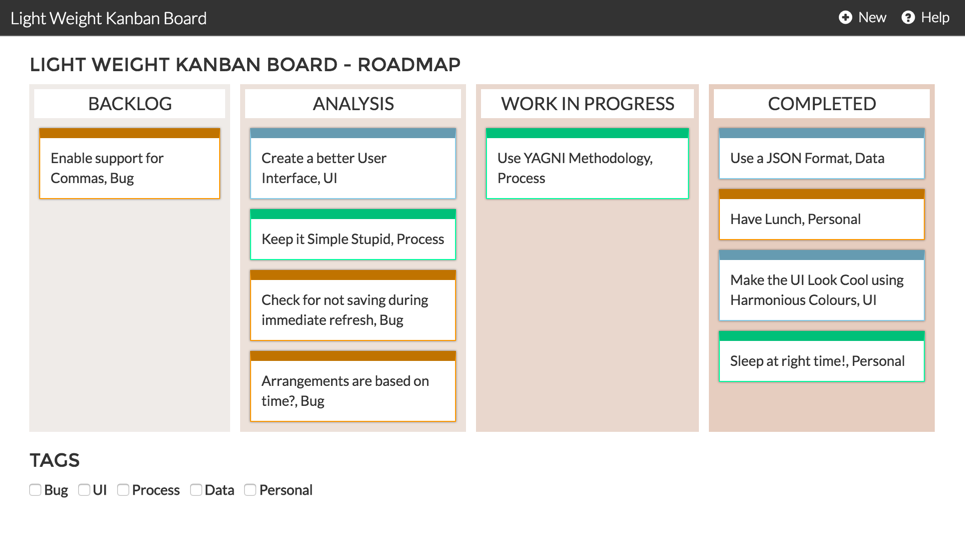
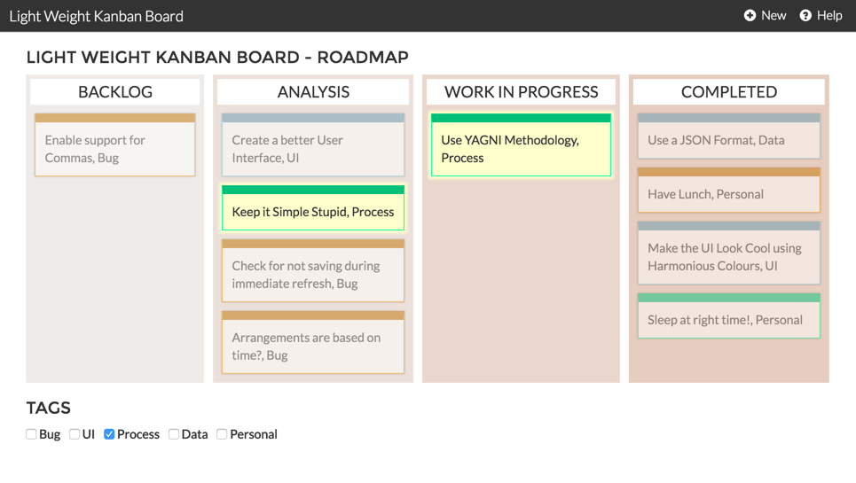

# Light Weight Kanban Board

## Motivation

As a developer, I would really like to have a simple agile methodolgy to manage my "To-Do" lists. I tried my level best to find a simple one, but I couldn't. Everything was either using a huge payload of frameworks, or needs sophisticated database. I thought, why not create my own version of a Light Weight Kanban Board, and also open source it to other developers.

Now that we have a working basic model of the code, contributions to the code are welcome. Please create a pull request for your contributions.

**Demo:** [Heroku](https://light-weight-kanban-board.herokuapp.com/)

## Requirements

* **Web Server:** Apache or IIS or nginx.
* **PHP Version:** PHP 5+. Should be backward compatible with older versions.
* **Browser:** Latest version of Internet Explorer, Google Chrome, Mozilla Firefox.

## Installation

* Clone or download this repository and upload it in your web server.
* The different boards are defined in `settings.js`.
* The colours for the states are defined in the `style.css` with the classes `.col_*`.
* The four different colours for the cards are defined in the `style.css` with the classes `.color_*`.
* The only PHP file that is used to fetch and write the data is `server.php`.
* The data file is defined in the `server.php` on the first line as `define('DATA_FILE', 'data.json');`. *It is recommended that you change the file name.*

## Features

* Pleasant User Interface with Responsive Web Design.
* No database needed. All that you need is a JSON file to import and export.
* Very light-weight. The code footprint is less than `150 kb`.
* Filtered views by Category. Very limited support.

## Screenshots

**Normal View**

**Highlighted / Tag Filtered View**

## Plugins & Framework

* [jQuery JavaScript Library](https://jquery.com/)
* [Bootstrap CSS Framework](https://getbootstrap.com/)

## License Information

Not all files bundles with this software is part of "Light Weight Kanban Board". Please look into the headers of the files.

Regarding "Light Weight Kanban Board": The software is a free software: you can redistribute it and/or modify it under the terms of the GNU General Public License as published by the Free Software Foundation, either version 3 of the License, or (at your option) any later version.

Light Weight Kanban Board is distributed in the hope that it will be useful, but WITHOUT ANY WARRANTY; without even the implied warranty of MERCHANTABILITY or FITNESS FOR A PARTICULAR PURPOSE. See the GNU General Public License for more details.

You should have received a copy of the GNU General Public License along with this package. If not, see http://www.gnu.org/licenses/.